# **Message to Mega README**

>**Authors note:** *This readme was written entirely by megamann81 and may lack detail for certain parts and features, if you would like to see a more detailed verison of the readme, please look at [DETAILEDREADME.md](DETAILEDREADME.md).*

The website features a black and white minimalist color palette with animations throughout it that I tried to make as cool looking while as resource optimised as possible.

# Main website features and widgets

### Visitor Message Widget
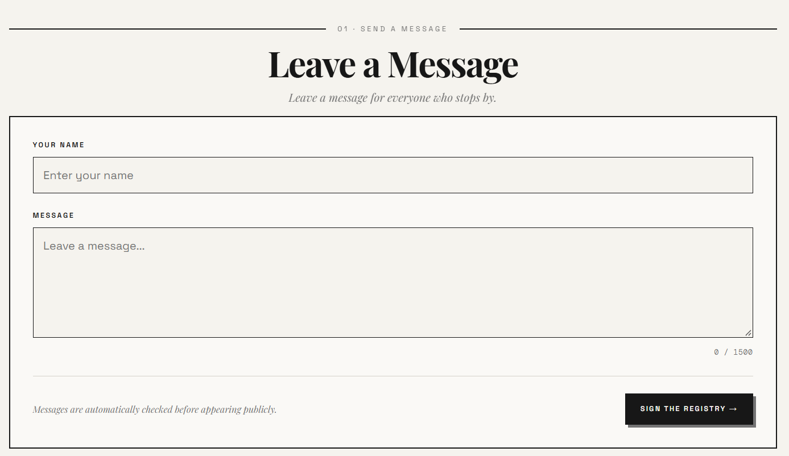
Includes:
- Custom Name
- Message box  
> ^ The message box maximum character limit is set by a variable in the backend of the project
- Scrambled ip addresses assigned to each message sent 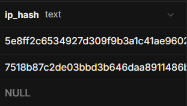
## Recent Visitor Widget
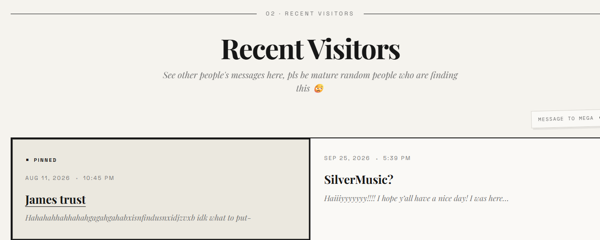
Includes:
- Pinnable comments, pinned from a form in the suprabase backend
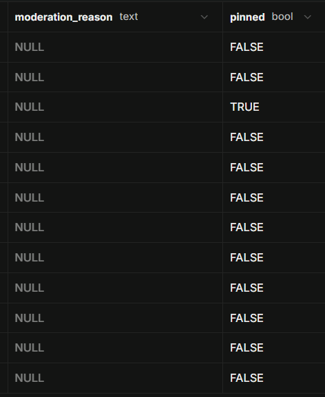
- Automatically expanding boxes
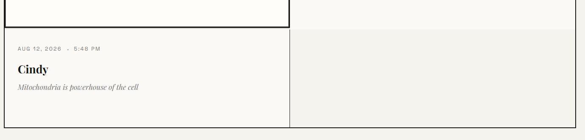

## Spotify Widget
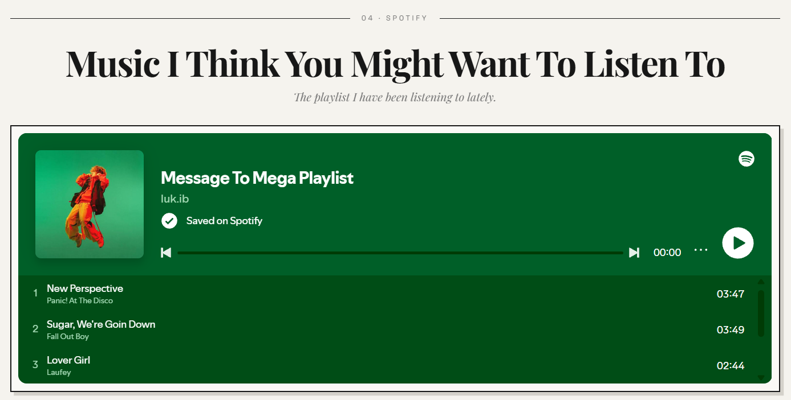
Includes:
- Spotify playlist widget
- Spotify account link (may remove later for privacy purposes)

## Website Suggestions Widget
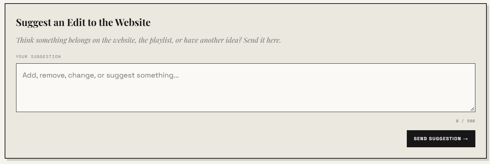
Includes:
- Form to suggest changes to the website  
(pretty straightforward isn't it)

## Git Repository(ies) Widget
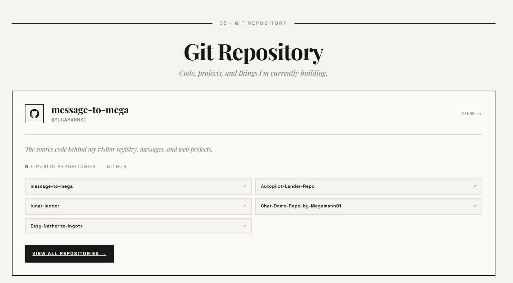
Includes:
- Github Project Link
- Smaller other projects and repositories below
- Only shows the pinned, public repositories that I have made

## Contact Widget
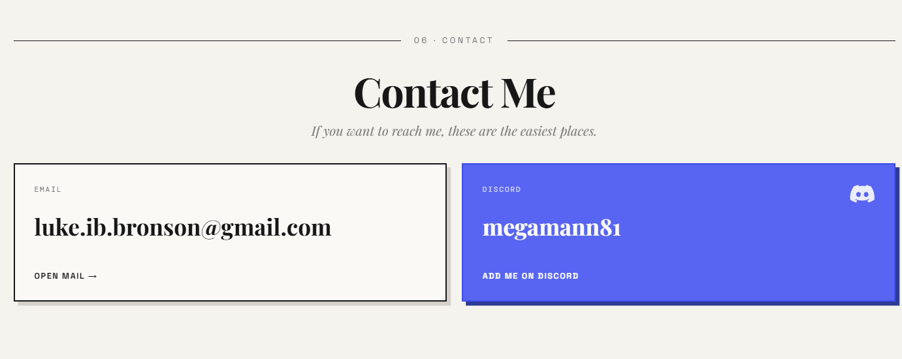
Includes:
- My contact information
- Mailto link for easy gmail access with whatever browser the user is using

## Credits at the bottom :)
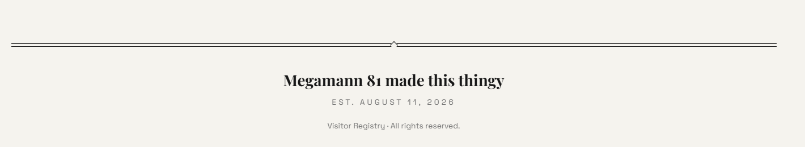

# Smaller features
### Other smaller features I integrated to make the project represent me more and to make it more interesting
## Heart clicker
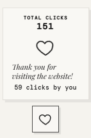  
### Heart clicker that allows you to heart the website and displays a little animation when you click it. The website also keeps a local user code to keep track of the amount of times you have clicked it, even after reloading the site. The side widget will follow your side scroll bar but will not clip into the top, instead moving the widget down when it hits the top of the screen.
## Page index
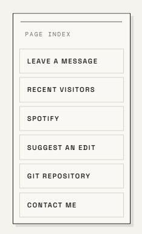
### Page index that expands out of a minimised state after you mouse over it. When you click on something in the page index it smoothly jumps to the connected widget.
## Title Leave a Message Jump Button
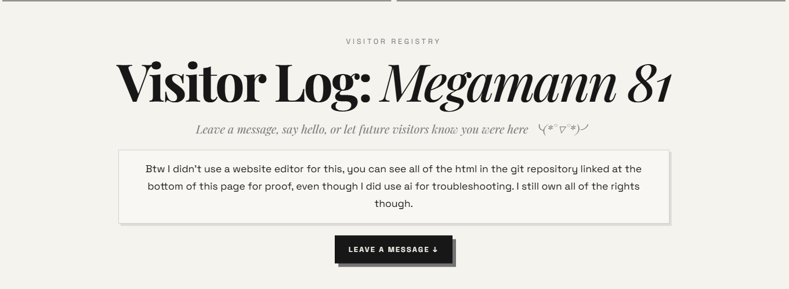
### When you click on this jump button you instantly jump to the message form widget with a letter particle animation

# Suprabase backend

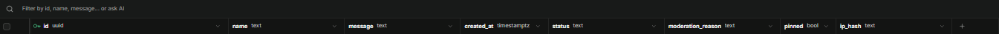
### When a message is sent 